# 第二章 Transformer架构

## 2.1 注意力机制
NLP 逐渐从最初的统计学习模型进行文本表示的向量空间模型、语言模型，通过Word2Vect的单层神经网络进入到通过神经网络学习文本表示的时代。

从计算机视觉为起源的神经网络的核心架构有三种：

1. 全连接神经网络（Feedforward Neural Network，FNN）：每一层的神经元都和上下两层的每一个神经元完全链接  
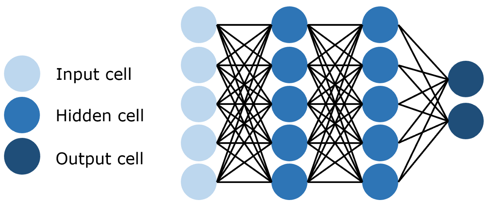  
2. 卷积神经网络（Convolutional Neural Network，CNN）：训练参数量远小于全连接神经网络的卷积层来进行特征提取和学习
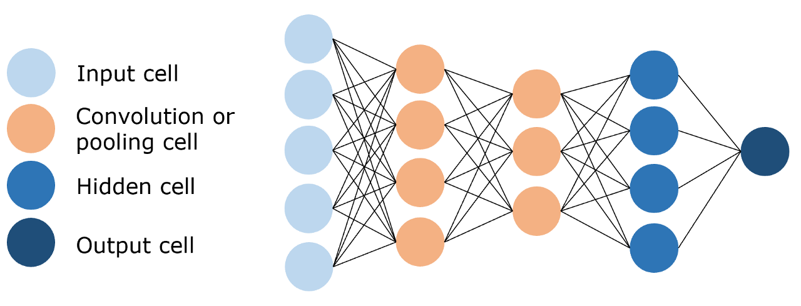  
3. 循环神经网络（Recurrent Neural Network，RNN），能够使用历史信息作为输入、包含环和自重复的网络  
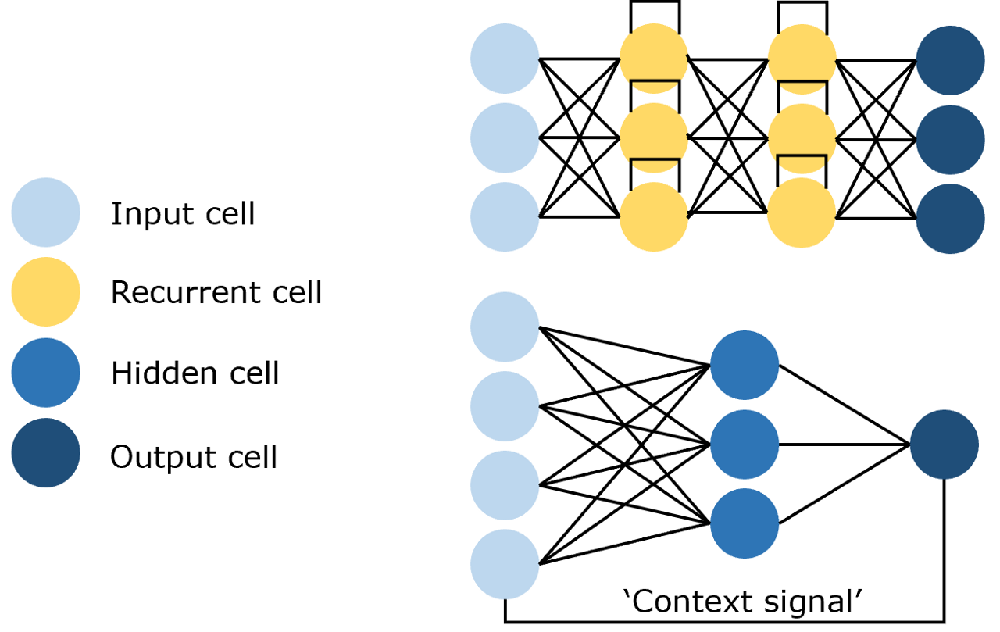  

注意！NLP的输入文本通常是序列格式，而RNN就是专用于 **处理序列、时序数据** 的神经网络，类似地LSTM也非常适合于捕捉时序信息并生成序列  

但 RNN 和 LSTM 有两个难以弥补的缺陷：  
1. 序列计算模式限制了并行计算的能力，而GPU只有在并行计算上能发挥出最大的优势  
2. RNN 难以捕捉长序列的相关关系。距离越远的输入关系越难被捕捉，在读取时需要把整个序列都读入内存然后以此计算，内存大小也限制了每次读取的长度  

所以，Transformer诞生了：完全由注意力机制构成的神经网络 
> " *LLM 的鼻祖及核心架构* "

### 2.1.1 什么是注意力机制
注意力机制由三个核心变量构成：  
- 查询值 Query
- 键值 Key
- 真值 Value

计算过程：  
- 计算 Query 和 Key 的相关性得到一个权重
  - 反映了从 查询内容出发，对文本每一个token应该分配的注意力相对大小  
- 把计算得到的权重和Value进行运算，得到最终的注意力结果

注意力机制的本质仍然是 ***加权求和*** ，通过计算查询和键值的相关性为真值进行加权，从而获得真值中每个token应该被分配的注意力 —— *拟合序列中每个词同其他词的相关关系*

### 2.1.2 深入理解注意力机制
在文本表示中，词向量被用来表征语义信息，语言模型在训练过程中的目标也是让语义相近的词在 **向量空间中的距离** 更近，语义较远的词在向量空间中的距离更远

通常使用 **欧氏距离** 来衡量词向量的相似性，也可以使用 ***点积*** 来衡量：
- 通过计算点积来计算词之间的相似度
- 再借助 softmax 函数把相似度转换到（0，1）之间的权重
- 这样得到的向量反映了query和每一个key的相似程度，同时权重相加为1，也就是注意力分数
- 再把权重和值向量对应相乘，即为注意力机制的基本公式
- 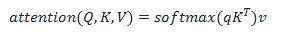  
- 进一步把值变成多维度的向量，就能同时一次性查询多个Query：
- 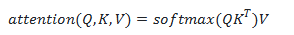
- 如果Q, K对应的维度比较大，softmax缩放的时候很容易导致不同值之间的差异很大，从而会影响梯度的稳定性。因此需要把Q,K相乘得到的权重做一个缩放：
- 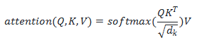

### 2.1.3 注意力实现

~~~python
{
    def attention(query, key, value, dropout=None):
        d_k = query.size(-1)  # 获取键向量的维度（键和值的维度相同）
        scores = torch.matmul(query, key.transpose(-2, -1)) / math.sqrt(d_k)
        # sofrmax
        p_attn = scores.softmax(dim=-1)
        if dropout is not None:
            p_attn = dropout(p_attn)
        # 根据注意力分数加权求和
        return torch.matmul(p_attn, value), p_attn 
}
~~~

### 2.1.4 自注意力
注意力机制的本质：
- 对两段序列的元素依次进行相似度计算，找出每一个元素对另一序列中每个元素的相关度
- 基于相关度对真值进行加权，即分配注意力

但实际应用中，往往只需要Q K之间的注意力结果，很少存在额外的真值Value
- 所以只需要拟合两个文本序列得到二者的注意力分数即可
- Q 往往来自于一个序列，K 与 V 来自于另一个序列，都通过参数矩阵计算得到，从而可以拟合这两个序列之间的关系

自注意力机制就是计算本身序列中每一个元素对其它元素的注意力分布，也就是QKV都为本身这一个序列
- 具体实现中，Q、K、V由 **同一个输入**，经过 **不同的参数矩阵** 计算得到

自注意力的代码实现就是把qkv都传入同一个参数  
~~~python
    attention(x, x, x)
~~~

### 2.1.5 掩码自注意力
掩码的作用：遮蔽一些特定位置的token，让模型在学习的过程中将 masked token 忽略掉

动机：让模型只能使用历史信息进行预测，而不能看到当前元素后面的元素（未来信息）
- 对一个文本序列，不断根据之前的token来预测下一个token，直到补全整个文本序列

但上述是一个 **串行过程** ，Transformer针对串行计算效率低的问题，提出了掩码自注意力的方法：  
- 生成一串掩码，遮蔽当前元素后面的所有token
- 一个序列masked之后被并行输入模型中
- 模型需要根据拿到的序列中可以看到的token预测 masked 的token：
- 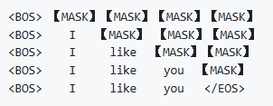

实现：  
- 掩码实际上是一个和文本序列等长的**上三角矩阵**
- 创建一个这样的上三角矩阵作为掩码，把对应位置的输入遮蔽掉（赋值为无限小）即可

~~~python
# 创建一个上三角矩阵，用于遮蔽未来信息。
# 先通过 full 函数创建一个 1 * seq_len * seq_len 的矩阵
mask = torch.full((1, args.max_seq_len, args.max_seq_len), float("-inf"))
# triu 函数的功能是创建一个上三角矩阵
mask = torch.triu(mask, diagonal=1)
~~~

该 Mask 矩阵上三角的元素均为 -inf，其他位置赋值0

在注意力计算时，把得到的注意力分数和 Mask 作和，再进行softmax操作

求和后，注意力分数矩阵的上三角区域结果都变成 -inf ，下三角区域不变。再经过softmax，-inf 的位置会被置为0，从而忽略了上三角区域的注意力分数实现遮蔽

### 2.1.6 多头注意力
一次注意力的过程只能拟合一种相关关系，单一的注意力机制对于复杂的语义相关性拟合并不全面

Transformer使用的时多头注意力机制，同时对一个语料进行多次注意力计算，每次注意力计算都能拟合不同的关系

所谓的多头注意力机制：  
- 将原始的输入序列进行多组的注意力处理  
- 把多组的自注意力结果拼接起来
- 输入线性层处理得到最终的输出  

代码实现中：  
- n个头对应的是 n 组的3个参数矩阵  
- 每一组进行同样的注意力计算，不同的参数矩阵通过反向传播实现不同的注意力结果
- 最后n个结果拼接输出即可

## 2.2 Encoder-Decoder
Encoder-Decoder 架构是实现注意力机制的核心组件

后续基于transformer架构的预训练语言模型基本都是对这个组件的改进，从而实现新的模型架构  
- BERT：只使用Encoder
- GPT：只是用Decoder

### 2.2.1 Seq2Seq 模型
Seq2Seq指的是：模型输入一个自然语言序列，输出一个不等长的自然语言序列

> 几乎所有NLP任务都可以视作一个Seq2Seq任务

Seq2Seq任务一般的处理思路是：对输入序列编码再解码————  
- 编码：输入序列通过隐藏层，编码为能够表征语义的向量或矩阵
- 解码：对编码得到的向量或矩阵再通过隐藏层数出，转换为对应   的目标序列  

Transformer每个Encoder都有 6个 Encoder Layer 组成，层层编码后在讲编码结果输出给Decoder的每一个layer

Transformer的encoder和decoder内部传统神经网络的经典结构：  
> 前馈神经网络FNN + 层归一化 + 残差连接  

### 2.2.2 前馈神经网络
前馈神经网络（Feed Forward Neural Network，下简称 FNN）实际上是一个**全连接的网络**，每一层的神经元都和上下两层的每一个神经元完全连接

每一个 Encoder Layer都包含一个注意力机制和前馈神经网络

FNN的实现就是经典的多层感知机MLP  
- 两个线性层中间加一个 RELU 激活函数构成  
- 加入Dropout防止过拟合  

### 2.2.3 层归一化 Layer Norm
层归一化， 是经典的归一化操作。主流的归一化操作就两种：  
- 层归一化（Layer Norm）
- 批归一化（Batch Norm）

归一化的核心是让 **不同层输入的取值范围或者分布能够比较一致** 。
- 深度网络经过多层传递，较深的层会
*集中* 之前所有层的参数变化，导致其输入的分布发生较大改变
-  随着神经网络参数的更新，每一层的输出分布是不同的，而且这个差异会随着深度的增加而增大  
-  但**需要预测的条件分布只有一种**，因此这种差异的增大会导致最终预测的误差

上述就是深度网络中需要归一化的原因，归一化操作把**每一层的输入**都归一化成**标准正态分布**

***批归一化***  

操作对象是一个 mini-batch，对一个batch，把其中的样本拆分出来一个 m 大小的 mini-batch, 先计算每个维度j上的样本均值  
    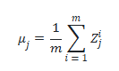  
再计算样本方差：  
    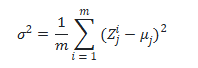  
最后，每个样本的值减去均值再除以方差得到标准正态分布（加上极小值避免分母为0）：  
    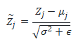

BN 的缺陷：  
- 训练时序列的每个step都需要保存对应的统计信息（均值和方差），耗时费力

***层归一化***
层归一化的方式和BN完全相同，只是统计量的维度不同，每个样本需要统计其在所有维度的值求出均值和方差  

具体代码实现中需要两个线性矩阵完成映射

### 2.2.4 残差连接
设计目的: 避免模型因为结构复杂、层数较深而退化  

残差连接就是把上一层的输入同时作为下一层的输入，这样下一层不仅要接受来自上一层的输出，同时还要加上上一层的输入  

每一个子层都设计一个残差连接，允许最底层的信息直接传递到高层，让高层专注于残差的学习  
- 高层：靠近输出端的层  

在每一个子层，输入多头自注意力层的同时，该输入会直接传递到该层的输出，然后该层输出与原输入相加，经过标准化后作为下一层的输入  
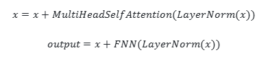

### 2.2.5 Encoder
Transformer 的 Encoder由N个 Encoder Layer组成，每个layer包括一个注意力曾和前馈神经网络  
- 每个 layer 中又有两个 layernorm，分别在attention和fnn之前
- n个layer之后，在最后加入一个layer norm实现规范化

### 2.2.6 Decoder
decoder中也有 N 个decoder layer ，每个decoder layer 中有两个注意力层（掩码自注意力和多头自注意力）和一个前馈神经网络  
- 掩码自注意力用来保证每个token只能只用该token之前的注意力分数
- 多头注意力层：掩码自注意力的输出作为query， encoder的输出作为key和value
- 每个decoder layer有**三个layernorm**，分别在掩码自注意力、多头子注意力和fnn之前  
- decoder最后输出之前同样需要layer norm

## 2.3 完整的Transformer
基于上文实现的组件，把encoder，decoder拼接起来，再加上embedding层就可以构建出完整的Transformer了

### 2.3.1 Embedding
嵌入层的任务：**把自然语言序列转换为计算机可以处理的向量**

embedding其实就是一个存储固定大小词典的嵌入向量查找表。

自然语言序列 -> 分词器tokenizer（把序列切分成token并转化为固定的index） -> embedding

Embedding 的输入形状通常为 **（batch_size，seq_len，1）**的矩阵，分别对应：  
1.  一批次处理的数量
2.  输入序列的长度
3.  tokenizer转化后的index值

torch中有专门进行嵌入的函数  
embedding内部就是一个可训练的（Vocab_size，embedding_dim）的**权重矩阵**，vocab_size对应词表的大小，dim则为需要嵌入的词向量的维度  

~~~python
self.tok_embeddings = nn.Embedding(args.vocab_size, args.dim)
~~~

### 2.3.2 位置编码Positional Encoding
RNN和LSTM中的输入序列会按照输入顺序串行处理

但Transformer实现并行计算的同时也在计算注意力的过程中丢失了位置信息。—— 对于每一个token，其他各个位置的token对其的注意力是平等的

所以需要加入位置编码，**用来保留序列中的相对位置信息**，再把位置编码加入到词向量的编码但中

Transformer的位置编码方式为正余弦函数编码，对序列中奇数和偶数位置的token采用不同的方式编码，pos为token在序列中的位置索引  
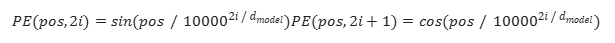

举例说明：  
输入：长度为4的句子 "I like to code"  
经过embedding得到词向量矩阵x，每一行代表对应索引token的词向量  
单词 “I” 的词向量：x0=[0.1,0.2,0.3,0.4]  
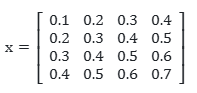  

该句子的位置编码矩阵：  

上面两个矩阵相加，即为经过位置编码后的词向量

### 2.3.3 整体Transformer

上图中layernorm在attention的后面，但源码中layernorm是在attention层前面的，也就是“Pre Norm”结构

“Pre Norm”结构可以使Loss更稳定，现在的LLM一般也采用的时这种结构