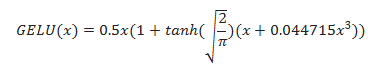

# 第三章 预训练语言模型PLM

# 3.1 Encoder-only PLM
针对Encoder、Decoder的特点，引入ELMo的与训练思路，出现了不同的对Transformer的优化方法：

- 只有Encoder层堆叠、提出不同的与训练任务下的掩码语言模型（Masked Language Model，MLM），实现一统自然语言理解任务（Natural Language Understanding，NLU）的模型BERT
- 仅有Decoder层的堆叠，使用原有的语言模型任务，不断增加模型参数和预训练语料，打造在自然语言生成NLG任务上优势明显的GPT
- GPT也是如今大火的LLM的基座模型

以 **Encoder-Only、Encoder-Decoder、Decoder-Only** 的顺序来依次介绍 Transformer 时代的各个主流预训练模型，分别介绍三种核心的模型架构、每种主流模型选择的预训练任务及其独特优势，这也是目前所有主流 LLM 的模型基础。

### 3.1.1 BERT
BERT，全名 Bidirectional Encoder Representations from Transformers ，源自Transformer的双向编码器表征  

地位：BERT出现以来，**预训练 + 微调** 成为了NLP任务的主流  
- 巨大的阶段性成果
- 重大进展

**（1）核心思想沿承**
- Transformer架构：
  - 在Transformer的基座模型上进行优化，堆叠encoder结构扩大模型参数，擅长**自然语言理解（NLU）**  
- 预训练 + 微调：  
  - ELMo：在训练数据上基于语言模型进行预训练，再针对下游任务进行微调

**（2）模型架构 —— Encoder Only**  

BERT 针对自然语言理解打造，输入是文本序列，输出一般是标签：情感分类积极/消极等  
- 本质也是一个 Seq2Seq 模型，只是没有加入对特定任务的 Decoder

怎样适配各种下游的NLU任务呢？  
- **模型顶层（输出端）**加入分类头prediction_heads  
- 作用：将多维度的隐藏状态输出 转变为 分类任务对应的维度（有多少类别即多少维度）  
- 内容：分类头就是线性层 + 激活函数， 输出维度和任务的类别数相等

BERT 不一样的激活函数：**高斯线性单元激活函数** GELU ——  

- 在激活函数中引入随即正则思想
- 通过输入自身的概率分布，决定抛弃还是保留自身的神经元

改进的位置编码：  
计算attention scores 之后，先进行位置嵌入融合相对位置信息  
- 其实就是一层线性矩阵，参数可训练  
- 比transformer的绝对位置编码你和的位置信息更丰富
- 缺点：增加了不少的模型参数，输入token的长度有限制

**（3）预训练任务**  
BERT 更大的创新点在于其提出的两个新的预训练任务上—— MLM 和 NSP（Next Sentence Prediction，下一句预测）。

把预训练和微调分离，完成一次预训练的模型可以仅微调之后引用在所有下游任务上

预训练数据的核心要求时极大的数据规模，几亿的token，这个规模是人工标注的全监督数据很难达到的。因此，预训练的数据全部是无监督的语料，互联网上的所有文本通过遮蔽下文将上文输入模型就可以进行训练

1. MLM 掩码语言模型：模拟“完形填空”的预训练任务。及能够利用海量的无监督语料，又能训练模型拟合双向语义关系的能力  
    - 随机选择15%的token，这些token有80%的概率被遮蔽，10%的概率被替换，10%的概率保持不变（消除与训练和微调任务的不一致）
    - 让模型被迫保持么一个token的上下文表征
  
2. NSP 下一个句子预测：判断一个句子对的两个句子是否是连续的上下文  
   - 正样本随机抽取任意连续句子对，负样本对句子打乱后随机抽取，可以具备几乎无限量的训练数据

BERT 的预训练数据量相比非预训练的模型有指数级增长

**（4）下游任务微调**  

微调：和训练时更新模型参数的策略一致，在特定任务、更少的训练数据、更小的batch_size上训练，参数更新的幅度更小

### 3.1.2 RoBERTa
相较于BERT的优化：
1. 去掉NSP预训练任务
2. 更大规模的预训练数据和**预训练步长**：训练数据时BERT的十倍
3. 更大的BPE此表（字节对编码）

意义：证明了 更大的预训练数据、更大的预训练步长的重要性

## 3.2 Encoder-Decoder PLM
### 3.2.1 T5
T5（Text-To-Text Transfer Transformer）是由 Google 提出的一种预训练语言模型, 将所有NLP任务统一表示为从文本到文本的转换问题 —— **大一统思想**

基于Transformer架构，包含编码器和解码器两个部分，使用自护注意力机制和多头注意力捕捉全局依赖关系，利用相对位置编码处理长序列中的位置信息，并在每层中包含前馈神经网络进一步处理特征。

（1）模型架构
还是encoder-decoder，编码器用处理输入文本，解码器用于处理输出文本，二者之间通过注意力机制进行信息交互实现文本的转换

## 3.3 Decoder only PLM
目前LLM的基础架构

decoder only系列的代表模型 GPT —— 集大成之作chat GPT —— 开源LLM基本架构的LLaMA模型（GPT模型基础上优化而来） —— 

### 3.3.1 GPT 
GPT，即 Generative Pre-Training Language Model，是由 OpenAI 团队于 2018年发布的预训练语言模型。虽然学界普遍认可 BERT 作为预训练语言模型时代的代表，但首先明确提出预训练-微调思想的模型其实是 GPT

Decoder-Only 结构也天生适用于文本生成任务

有 Encoder 的编码输入，Decoder 层仅保留了一个带掩码的注意力层，并且将 LayerNorm 层从 Transformer 的注意力层之后提到了注意力层之前。原来的transformer的decoder是由双层注意力计算的

由于不存在 Encoder 的编码结果，Decoder 层中的掩码注意力也是自注意力计算。也就是对一个输入的 hidden_states，会通过三个参数矩阵来生成 query、key 和 value，而不再是像 Transformer 中的 Decoder 那样由 Encoder 输出作为 key 和 value。

GPT的预训练任务—— 因果语言模型 CLM Casual Language Model

CLM是一个经典的补全形式，也天然契合人类书写自然语言文本的习惯，和下游任务也直接匹配。因为CLM更加直接，因此也可以使用海量的语料进行预训练

GPT-1：decoder-only，体量和预训练数据较少，

GPT-2：结构大致沿袭GPT1，扩大了模型参数规模，将 Post-Norm 改为了 Pre-Norm（也就是先进行 LayerNorm 计算，再进入注意力层计算）。进行改动的核心原因在于，由于模型层数增加、体量增大，梯度消失和爆炸的风险也不断增加，上述优化时为了使模型梯度更加稳定。
- 以 zero-shot（零样本学习）为主要目标，也就是不对模型进行微调，直接要求模型解决任务。
- 在大模型时代，zero-shot 及其延伸出的 few-shot（少样本学习）才开始逐渐成为主流

GPT-3：大幅增加预训练数据和模型体量，LLM 的开创之作，除去其巨大的体量带来了涌现能力的凸显外，还在于其提出了 few-shot 的重要思想。量变带来质变  
- 而 few-shot 是对 zero-shot 的一个折中，旨在提供给模型少样的示例来教会它完成任务。few-shot 一般会在 prompt（也就是模型的输入）中增加 3~5个示例，来帮助模型理解

### 3.3.2 LLaMA 
LLM 的普适架构

LLaMA模型的整体结构与GPT系列模型类似，只是在模型规模和预训练数据集上有所不同

GLM 预训练任务更多的优势还是展现在预训练模型时代，迈入 LLM 时代后，针对于超大规模、体量的预训练，CLM 展现出远超 MLM 的优势。

GLM 的核心创新点主要在于其提出的 GLM（General Language Model，通用语言模型）任务，这也是 GLM 的名字由来。GLM 是一种结合了自编码思想和自回归思想的预训练方法。所谓自编码思想，其实也就是 MLM 的任务学习思路，在输入文本中随机删除连续的 tokens，要求模型学习被删除的 tokens；所谓自回归思想，其实就是传统的 CLM 任务学习思路，也就是要求模型按顺序重建连续 tokens。